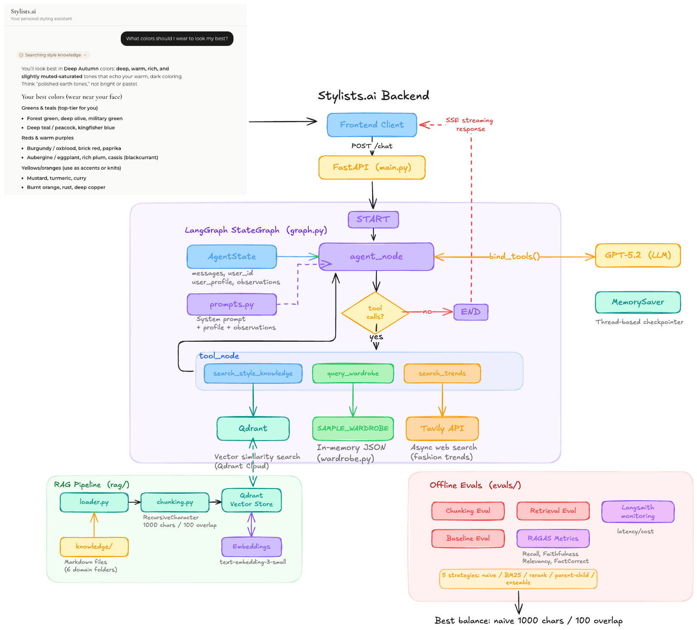

# Stylists AI: Certification Challenge Report

**Project:** Stylists AI — An AI Personal Style Agent

**Author:** Yingzhe Li

**Date:** March 2026

**GitHub:** https://github.com/fox8991/stylists-ai-backend-cert

**Live Demo:** [Frontend](https://stylists-ai-frontend-cert.vercel.app/chat) | [Backend](https://stylists-ai-backend-cert.onrender.com/)

---

## Task 1: Defining the Problem, Audience, and Scope

### Problem Statement

People often struggle to style outfits from their own closet, and no existing applications offer a personal AI agent that learns their style and helps them wear what they own instead of pushing them to buy more.

### Why This Is a Problem

Many people struggles with problems such as having a full closet but don't know what to wear problem. A lot of existing personal styling apps fail in two spectrums: wardrobe apps often require 8+ hours of manual setup before delivering any value, while AI-powered apps push shopping recommendations instead of helping you use what you own. This is a problem I have personally as well, and there are over 100K+ monthly Google search query on topics such as "outfit generator", "what colors look good on me", etc.

Stylists AI is a LangGraph ReAct agent that combines RAG over a curated fashion knowledge base (color theory, body shapes, occasion dressing), tool-calling for wardrobe queries and live trend search via Tavily, and a user profile memory system that persists preferences across conversations. The result is personalized styling advice grounded in real expertise and the user's own wardrobe.

### Evaluation Questions

These queries demonstrate the system's core capabilities across its knowledge domains and tools:

1. **"What colors should I wear to look my best?"** — RAG retrieval from color theory knowledge + user profile (long term memory)
2. **"What fits and silhouettes work best for my body type?"** — RAG retrieval from body shape knowledge + user profile (long term memory)
3. **"What should I wear to a business casual office?"** — RAG retrieval from occasion dressing knowledge + user profile (long term memory)
4. **"What essentials am I missing in my wardrobe?"** — RAG + wardrobe tool + user profile (long term memory)
5. **"What should I wear to a wedding from my closet?"** — RAG + wardrobe tool + user profile (long term memory)
6. **"What's trending this spring, and can I put together an outfit from what I own?"** — All 3 tools: trend search + RAG + wardrobe + user profile (long term memory)

Without RAG over styling expertise, user profile memory, and wardrobe data, a general chatbot cannot provide grounded, personalized answers to these questions.

---

## Task 2: Proposed Solution

### Solution Overview (1-2 paragraphs)

For the certification challenge, the stylists.ai backend is a single ReAct (Reason + Act) agent built with Langgraph. The agent has three tools: style knowledge search (RAG tool over style knowledge vector DB hosted on Qdrant), a live web trend search (using Tavily), and a wardrobe query tool (query over sample wardrobe data for user). We also stored sample user profile (proxy to long term memory) and sample wardrobe data (proxy to a wardrobe database) for the cert challenge, which will provide personalized style suggestions. The FastAPI backend is deployed on Render, and will stream responses to a [chat interface](https://stylists-ai-frontend-cert.vercel.app/chat), which is Next.js frontend website deployed on Vercel.

We have also built a RAG pipeline, which supports flexible chunking strategies,  vector store creation, multiple retriever strategies (naive, BM25, parent-child, contextual compression, ensemble). This is used for both offline evals (chunking strategies + retriever strategies), and creating the RAG components for actual backend (e.g., vector store, retriever). 

To the user, it feels like chatting with a personal stylist who already knows your body type, color season, and style preferences. The agent retrieves expert-level styling knowledge from a curated fashion knowledge base, checks your actual wardrobe before making suggestions, and can pull in current trends from the web, all while explaining the "why" behind every recommendation.

### Infrastructure Diagram

### Tooling Choices

| Component | Choice | Why |
|-----------|--------|-----|
| **Agent framework** | Langchain/LangGraph | Flexible agent framework to build ReAct loop with tool-calling, streaming support, checkpointing for conversation memory, what we used in class |
| **LLM** | GPT-5.2 for chat, GPT-4.1-mini for SDG/eval | GPT 5.2 is SOTA model with strong tool-calling reliability for production; GPT 4.1-mini has good balance of quality and cost for evaluation purpose |
| **Embeddings** | OpenAI text-embedding-3-small | Cost-effective, good retrieval quality for our domain knowledge size |
| **Vector store** | Qdrant Cloud | Managed hosting for vector store, sufficient free tier |
| **Web search** | Tavily API | Designed for LLM tool use, returns clean structured results |
| **Backend Framework** | FastAPI | Natural choice for hosting a langgraph agent based backend, Async support, SSE streaming |
| **Frontend** | Next.js (Vercel) | Fast deployment, good streaming/SSE support |
| **Monitoring** | Langsmith | Comprehensive observability support |

### RAG and Agent Components

**RAG components:**
- **Knowledge base:** 24 curated markdown files across 6 domains (color theory, body shapes, style archetypes, occasion dressing, wardrobe building, fundamentals)
- **Chunking:** RecursiveCharacterTextSplitter (1000 chars / 100 overlap) — validated via RAGAS eval for various chunking strategies
- **Embeddings:** OpenAI text-embedding-3-small (1536 dimensions)
- **Vector store:** Qdrant Cloud (one time setup and is always available for backend; in-memory vector store needs to rebuild everytime backend restarts)
- **Retrieval:** Naive dense similarity search, k=10 - balance performance and cost/latency, validated via RAGAs evale across various retriever strategies 

**Agent components:**
- **Architecture:** Single LangGraph ReAct agent with tool-calling loop
- **Tools:** `search_style_knowledge` (RAG), `search_trends` (Tavily), `query_wardrobe` (wardrobe filter over a sample in-memory wardrobe data)
- **System prompt:** Dynamically injects user profile (color season, body shape, style archetype, preferences) and observations
- **Short-term memory:** MemorySaver checkpointer (in-memory for cert, Postgres for production)
- **Long-term memory:** User profile (style preferences, body type, color season) is hardcoded as a demo profile for the cert challenge; will switch to a persistent memory store with per-user namespacing for demo day.

---

## Task 3: Dealing with the Data

### Data Sources and External APIs

| Data Source | Type | What It's Used For |
|--------|------|-------------------|
| **24 knowledge base files** | Static, curated in 6 domains: color_theory, body_shapes, style_archetypes, occasion_dressing, wardrobe_building, fundamentals | RAG knowledge base for expert styling advice across 6 domains, built from deep-research reports across Gemini/Claude/ChatGPT for |
| **Sample wardrobe data** | Static, in-memory | 19 clothing items representing a demo user's closet (hardcoded for cert, database for production) |
| **Demo user profile** | Static, in-memory | Hardcoded style profile (Deep Autumn, inverted triangle, classic natural) injected into system prompt |
| **Qdrant Cloud** | Managed vector DB | Stores and retrieves embedded knowledge chunks |

| API Source | Type | What It's Used For |
|--------|------|-------------------|
| **Tavily API** | External API | Real-time web search for current fashion trends |

### Default Chunking Strategy

**Strategy:** RecursiveCharacterTextSplitter with **1000 characters / 100 character overlap**.

**Why this configuration:**
We evaluated three chunking strategies using RAGAS (all with naive dense retrieval, k=10):

| Config | Chunk Size | Overlap | Chunks | Context Recall | Faithfulness | Answer Relevancy | Composite |
|--------|-----------|---------|--------|---------------|-------------|-----------------|-----------|
| Small | 250 | 50 | 6,309 | 0.687 | 0.835 | 0.949 | 0.824 |
| Medium | 500 | 50 | 3,073 | 0.760 | 0.833 | 0.945 | 0.846 |
| **Large (chosen)** | **1000** | **100** | **1,365** | **0.842** | **0.869** | **0.947** | **0.886** |

We chose the 1000/100 configuration because it performed the best across the board. This is likely because our larger chunks preserved complete styling explanations while still being specific enough for accurate retrieval, while smaller chunks broke up reasoning mid-thought, hurting context recall.

We also tested k-values (3, 5, 10) and found k=10 performed best, which means more retrieved chunks gave the LLM richer context for our styling queries over our specific knowledge base.

---

## Task 4: Build End-to-End Prototype

### Architecture

The prototype consists of:

- **Frontend:** Next.js chat interface deployed on Vercel: https://stylists-ai-frontend-cert.vercel.app/chat
- **Backend:** FastAPI server deployed on Render: https://stylists-ai-backend-cert.onrender.com/
  - Backend is hosted on free-tier plan, so Render will shut down the server after 15-minutes of in-activity. So new request from UI may take more than a minute to respond.
- **Endpoints:**
  - `POST /chat` — SSE streaming (default) or JSON response (`?stream=false`)
  - `GET /health` — Server health check

### How It Works

1. User types a styling question in the chat UI
2. Frontend sends POST request to `/chat` endpoint
3. FastAPI builds input state with user profile and sends to LangGraph agent
4. Agent reasons about the query and decides which tools to call
5. Tool results stream back as SSE events (`tool_call`, `tool_result`, `text` tokens)
6. Frontend renders tool indicators and streams the response in real-time

### Tests

Both unit-tests in `tests/` folder and end-to-end test using the front-end.

---

## Task 5: Evaluation (RAGAS)

### Evaluation Setup

**Synthetic data:** 21 questions generated using RAGAS SDG across three categories:
- 7 single-hop specific questions (direct factual retrieval)
- 7 multi-hop abstract questions (reasoning across multiple chunks)
- 7 multi-hop specific questions (detailed cross-domain queries)

The test set includes deliberately misspelled and informal queries (e.g., "wat is h shap for mens?") to test robustness.

Synthetic data location: [`evals/synthetic_testset.csv`](evals/synthetic_testset.csv)

**Metrics evaluated:**
- **Context Recall** — did we retrieve the right chunks?
- **Faithfulness** — is the response grounded in retrieved context (no hallucination)?
- **Answer Relevancy** — does the response actually answer the question?
- **Factual Correctness** — are the facts in the response accurate?
- **Context Entity Recall** — are key entities from the reference captured in context?

**Evaluation LLM:** GPT-4.1-mini (for both RAG generation and RAGAS evaluation)

### Baseline Results (Naive Dense Retrieval, k=10, 1000/100 chunks)

| Metric | Score |
|--------|-------|
| Context Recall | 0.826 |
| Faithfulness | 0.906 |
| Answer Relevancy | 0.948 |
| Factual Correctness | 0.605 |
| Context Entity Recall | 0.191 |

### Conclusions

The baseline pipeline achieves strong faithfulness (0.906) and answer relevancy (0.948), meaning the agent rarely hallucinates and directly addresses user questions. Context recall (0.826) shows the retriever finds most relevant chunks. The lower factual correctness (0.605) and context entity recall (0.191) reflect the subjective nature of fashion advice.

---

## Task 6: Improving the Prototype

### Chosen Advanced Retrieval Technique

We evaluated **5 retrieval strategies**:

1. **Naive dense retrieval** (baseline) — cosine similarity search, k=10
2. **BM25 sparse retrieval** — keyword-based matching, k=10
3. **Reranking** — dense retrieval k=20, then Cohere rerank-v3.5 to top 10
4. **Parent-Child** — embed small chunks (400 chars), return parent chunks (2000 chars)
5. **Ensemble** — all 4 retrievers with equal-weight reciprocal rank fusion

### Implementation of advanced retrieval technique
Implementation of advanced retrieval strategies are done in [`evals/ragas_eval.ipynb`](evals/ragas_eval.ipynb) notebook for offline evale. For production code, the retriever code is defined in [`rag/retrieval.py`](rag/retrieval.py) file.

### Results Comparison

| Strategy | Context Recall | Faithfulness | Answer Relevancy | Factual Correctness | P50 Latency | Cost/query |
|----------|---------------|-------------|-----------------|--------------------| ------------|------------|
| **Ensemble** | **0.941** | **0.938** | 0.947 | **0.629** | 15.2s | ~$0.05 |
| **Naive k=10** | 0.826 | 0.906 | **0.948** | 0.605 | 6.3s | ~$0.01 |
| Rerank (k=20→10) | 0.841 | 0.848 | 0.945 | 0.561 | 13.8s | ~$0.02 |
| Parent-Child | 0.802 | 0.886 | 0.947 | 0.584 | 4.9s | ~$0.02 |
| BM25 k=10 | 0.666 | 0.768 | 0.909 | 0.580 | 5.7s | ~$0.01 |

*Latency and cost from LangSmith dashboard.*: https://smith.langchain.com/public/798c2f33-3244-4de4-acf7-9f9bfbc4358d/d

### Analysis

- **Ensemble scores highest** across the board but is the slowest (15.2s) and most expensive (~$0.05/query) plus Cohere API costs.
- **Naive dense retrieval is the best production tradeoff** — competitive quality at 1/5 the cost and 2.4x faster, with no external API dependencies.
- **BM25 underperforms** on styling queries that need semantic understanding ("what looks good on me"), not keyword matching.
- We chose **naive for production** given the small quality gap vs ensemble doesn't justify the added cost and latency.

---

## Task 7: Next Steps

### Keeping Dense Vector Retrieval?

Yes, we plan to keep naive dense vector retrieval for Demo Day. First of all the RAG component includes a curated set of style knowledge base which is always useful for answering user queries about styles. Second, as far as the retriever goes, our RAGAS evaluation showed that while ensemble retrieval scored the highest, it's also slow and costly. The naive retriever on the other hand, provides strong retrieval quality at lower latency, so we'll keep it for demo day.

For Demo Day, the improvements will focus on the **agent layer** rather than retrieval:
- Adding more advanced agent architecture beyond a single ReAct loop for more advanced use cases
- Adding persistent memory (user profiles + learned observations via LangGraph Store)
- Moving from hardcoded demo data to database-backed wardrobe with user upload
- Persistent conversation history via PostgreSQL checkpointer

---

## Appendix

### Key Files

| File | Purpose |
|------|---------|
| [`app/main.py`](app/main.py) | FastAPI endpoints |
| [`app/agent/graph.py`](app/agent/graph.py) | LangGraph ReAct agent |
| [`app/agent/prompts.py`](app/agent/prompts.py) | System prompt with profile injection |
| [`app/tools/style_knowledge.py`](app/tools/style_knowledge.py) | RAG retrieval tool |
| [`app/tools/search_trends.py`](app/tools/search_trends.py) | Tavily trend search tool |
| [`app/tools/query_wardrobe.py`](app/tools/query_wardrobe.py) | Wardrobe filter tool |
| [`app/data/wardrobe.py`](app/data/wardrobe.py) | Sample wardrobe items |
| [`rag/chunking.py`](rag/chunking.py) | Document chunking |
| [`rag/vectorstore.py`](rag/vectorstore.py) | Qdrant vector store |
| [`rag/retrieval.py`](rag/retrieval.py) | Retriever factories |
| [`evals/ragas_eval.ipynb`](evals/ragas_eval.ipynb) | Full RAGAS evaluation |

### Links

- **Loom Demo:** [TODO]
